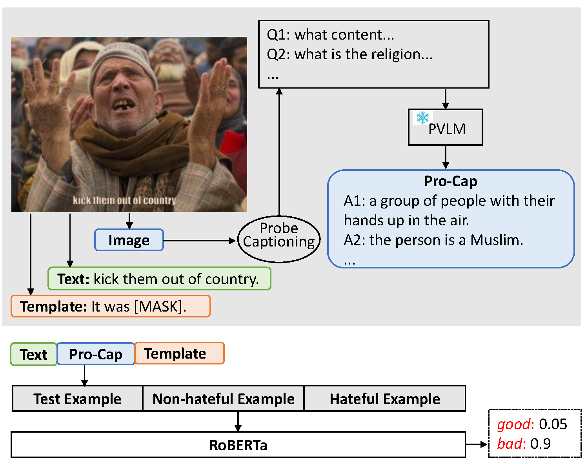
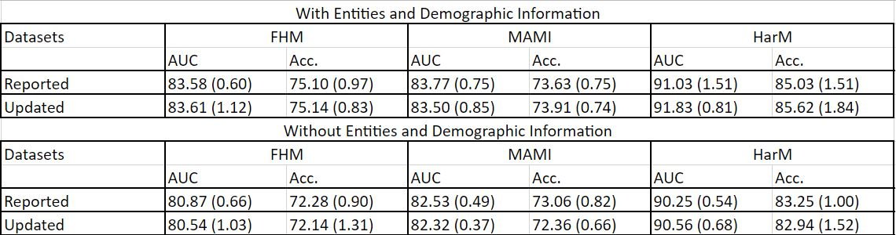

# Pro-Cap: Leveraging a Frozen Vision-Language Model for Hateful Meme Detection

This includes an original implementation of "[Pro-Cap: Leveraging a Frozen Vision-Language Model for Hateful Meme Detection][paper]" by Rui Cao, Ming Shan Hee, Adriel Kuek, Wen-Haw Chong, Roy Ka-Wei Lee, Jing Jiang.

<p align="center">
  
</p>

This code provides:
- Codes for generating Pro-Cap according to probing questions with frozen pre-trained vision-language models (PT-VLMs).
- Commands to run the models and get numbers reported in main experiment of the paper.

Please leave issues for any questions about the paper or the code.

If you find our code or paper useful, please cite the paper:
```
@inproceedings{ cao2023procap,
    title={Pro-Cap: Leveraging a Frozen Vision-Language Model for Hateful Meme Detection},
    author={ Rui Cao, Ming Shan Hee, Adriel Kuek, Wen-Haw Chong, Roy Ka-Wei Lee, Jing Jiang},
    journal={ ACM MM },
    year={ 2023 }
}
```

### Announcements
07/26/2023: Our paper is accepted by ACM MM 2023. 

## Content
1. [Installation](#installation)
2. [Prepare Datasets](#prepare-datasets)
3. [Pro-Cap Generation](#pro-cap-generation) (Section 4.2 of the paper)
    * [Step 1: Pre-processing of Datasets](#step-1-preprocessing-of-datasets) (Section 4.2 of the paper)
    * [Step 2: Prompt Frozen PT-VLMs](#step-2-prompt-frozen-ptvlms) (Section 5.2 of the paper)
4. [Experiments](#experiments) (Section 4 of the paper)
    * [Performance of Models](#performance-of-models)
    * [PromptHate with Pro-Cap](#prompthate-with-procap)
    * [BERT with Pro-Cap](#bert-with-procap)

## Installation
The code is tested with python 3.8. To run the code, you should install the package of transformers provided by Huggingface. The code is implemented with the CUDA of 11.2 (you can also implement with other compatible versions) and takes one Tesla V 100 GPU card (with 32G dedicated memory) for model training and inference.

###
## Prepare Datasets  
We have tested on three benchmarks for hateful meme detection: *Facebook Hateful Meme* (FHM), *Multimedia Automatic Misogyny Identification* (MAMI) and *Harmful Memes* (HarM). Datasets are available online. You can either download datasets via links in the original dataset papers or use the files in the **Data** folder provided by us.

For memes, we conduct data pre-processing such as image resizing, text detection and removal and image impainting according to the [HimariO's project][ronzhu]. In our augmentation setting (i.e., augmentation of entities and demographic, see Section 5.3 for details), we detect entities with Google Vision API and conduct face recognition with FairFace. All augmented information is included in our provided data in the **Data** folder. If you want to apply to your own data, please refer to [HimariO's project][ronzhu] for more details.

## Pro-Cap Generation

Here we describe how we generate Pro-Cap with frozen pre-trained vision-language models (PT-VLMs). Specifically, we design several probing questions highly related to hateful content detection and prompt PT-VLMs with these questions and meme images. 

### Step 1: Preprocessing of Datasets
To alleviate noisy in input images when prompting PT-VLMs, we detect meme texts on images, remove texts and conduct image impaintings to obtain *clean images*. Due to the data privacy policy, we are unable to share the cleaned images here. Specifically, we use EasyOCR for text detection and MMEditing for image impainting. 

### Step 2: Prompt Frozen PT-VLMs
We next prompt frozen PT-VLMs with questions and cleaned images to obtain Pro-Cap. You can generate Pro-Cap with our code at [codes/Pro-Cap-Generation.ipynb](codes/Pro-Cap-Generation.ipynb). Or you can alternatively use generated Pro-Cap shared in [codes/Ask-Captions](codes/Ask-Captions).

## Experiments
<p align="center">
  
</p>

### Performance of Models
Before uploading codes, we re-run the codes. Because of the updating of the versions of transformers package, we observe a small variance compared with the reported performance in the paper. We conclude both the reported results and the re-implemented result in the Figure above. There is no significant difference according to p-value. We share both the re-implemented logger files and the logger files for the reported performance in [codes/logger](codes/logger) and [codes/reported](codes/reporte).

### Performance of Models
To obtain our reported performance, please run the script in [codes/src](codes/src):
```bash
bash run.sh
```

Pay attention to the following values in [codes/src/config.py](codes/src/config.py)  
- CAP_TYPE to 'vqa'
- MODEL to 'pbm'
- change DATA_PATH and CAPTION_PATH to your local path
- ASK_CAP to 'race,gender,country,animal,valid_disable,religion'
- set ADD_ENT and ADD_DEM both True if in the augmentation setting or set both False

### BERT with Pro-Cap

```bash
bash run.sh
```
Pay attention to the following values in [codes/src/config.py](codes/src/config.py)
- CAP_TYPE to 'vqa'
- MODEL to 'bert'
- change DATA_PATH and CAPTION_PATH to your local path
- ASK_CAP to 'race,gender,country,animal,valid_disable,religion'
- set ADD_ENT and ADD_DEM both True if in the augmentation setting or set both False

[paper]: https://arxiv.org/abs/2308.08088
[ronzhu]: https://github.com/HimariO/HatefulMemesChallenge
